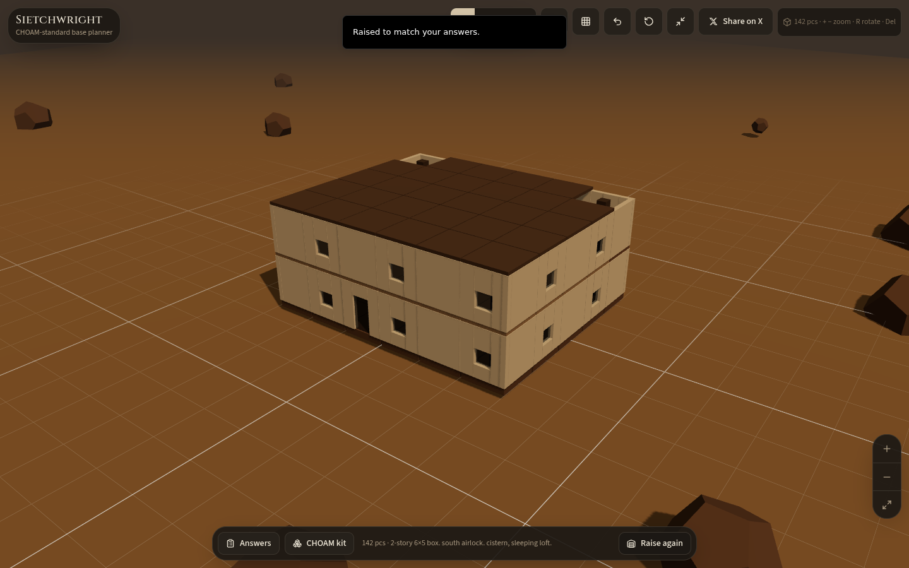

# Sietchwright

In-browser **Dune: Awakening** CHOAM-kit 3D base planner.

Answer a short questionnaire (pad size, stories, shape, door facing, vehicle bay). Sietchwright raises a schematic you can orbit, zoom, inspect, and share: foundations, walls, two-high garage doors, stairs, hatches, the whole standard set.

**Live:** [sietchwright.com](https://sietchwright.com)

[](https://github.com/doschott/sietchwright/actions/workflows/ci.yml)
[](LICENSE)
[](https://vercel.com/new/clone?repository-url=https://github.com/doschott/sietchwright)



**Not affiliated with Funcom, Legendary, or the Herbert estate.** Dune, Dune: Awakening, CHOAM, and related names belong to their owners. This is a fan planning tool.

## Why it exists

A lot of players can survive Arrakis and still freeze when the Construction Tool opens. Sietchwright is for people who are **not architects**. You answer questions in plain language. The yard follows those answers. Piece marks match in-game CHOAM Facility names so you can build the hologram on the sand.

It stays in your browser. No account. No database. The last yard is saved in `localStorage`.

## What you can do

1. **Plan.** Pad, stories, box / courtyard / hangar / watchtower, people door, vehicle, extras.
2. **Raise.** One click builds a deterministic schematic. The people door sits on the wall you named. A vehicle gets a two-cell-wide, two-story garage on the wall you named.
3. **See.** Iso, top, and south cameras. Zoom in, zoom out, or fit the yard. Hide menus (`H`) when you want a clear look at the build.
4. **Modify.** Change answers and raise again, or place extra CHOAM pieces by hand from the kit.
5. **Build in-game.** Inspector lists in-game names, cell, story, facing, and a granite bill.
6. **Share.** Tweet the name, piece count, and brief. The link is always `https://sietchwright.com`.

## UI (one panel at a time)

Older builds stacked a scrolling questionnaire, a scrolling kit, and a scrolling inspector over the 3D yard. That hid the building you just raised.

Now:

- The **yard is full-screen**.
- A thin **bottom bar** holds Plan, CHOAM kit, and Raise.
- **Plan**, **kit**, and **inspector** open as a single side panel (desktop) or bottom sheet (phone). They never stack.
- **+ / − / Fit** sit on the yard. Mouse wheel still zooms.

## Stack

- [TanStack Start](https://tanstack.com/start) + React 19
- Three.js via [React Three Fiber](https://r3f.docs.pmnd.rs/) + drei
- Tailwind v4, Zustand
- Builds to [Vercel](https://vercel.com) through Nitro’s `vercel` preset

## Run locally

Node 22+.

```bash
npm ci
npm run dev
```

Open the URL Vite prints (default http://localhost:5173).

```bash
npm test
npm run typecheck
npm run build
```

## Docs

| Doc | What it covers |
|-----|----------------|
| [docs/architecture.md](docs/architecture.md) | How the app is put together |
| [docs/choam.md](docs/choam.md) | In-game CHOAM Facility facts the planner uses |
| [docs/ui.md](docs/ui.md) | Menu system, zoom, personas |
| [docs/keyboard.md](docs/keyboard.md) | Shortcuts |
| [CONTRIBUTING.md](CONTRIBUTING.md) | How to send a PR |
| [CODE_OF_CONDUCT.md](CODE_OF_CONDUCT.md) | How we treat each other |
| [SECURITY.md](SECURITY.md) | How to report a vulnerability |
| [CHANGELOG.md](CHANGELOG.md) | What changed |

## CHOAM notes

- Grid is square. Rotation `0` is south (`+Z`), `90` east, `180` north, `270` west.
- **Garage Door** is modeled as two cells along the wall and two stories tall. Funcom has not published the cell math; measure in-client if you are doing a precision hangar. A 1-story request with a vehicle is raised to two stories so the door fits.
- Courtyard leaves an open inner court. Hangar keeps a double-height bay.
- Granite in the bill is CHOAM **Facility** (Advanced Construction Kit), from [awakening.wiki](https://awakening.wiki/CHOAM_Facility_Set).

## Contributing

Issues and PRs are welcome. This is Daniel Schott’s first public open-source project; the repo is set up for multiple contributors. See [CONTRIBUTING.md](CONTRIBUTING.md).

Good first issues: piece accuracy, garage-door in-game measurement, extra presets, a11y, translations.

## License

[MIT](LICENSE) © 2026 Daniel Schott
